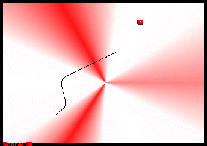



## \[ Great Uncle Worm \] \- 360 degree Nibbles Game

### Description

This is much more than a simple four-directional worm game. Players can move in all directions and can play in a variety of modes and settings. High scores for each mode are saved and calculated. Updated version adds music and several bug fixes and optimizations. Thanks for checking out my game and please vote and give feedback.
 
### More Info
 

             |
---                |---
**Submitted On**   |2004-12-19 14:24:36
**By**             |[Michael Bentley](https://github.com/Planet-Source-Code/PSCIndex/blob/master/ByAuthor/michael-bentley.md)
**Level**          |Intermediate
**User Rating**    |4.8 (58 globes from 12 users)
**Compatibility**  |VB 6\.0
**Category**       |[Games](https://github.com/Planet-Source-Code/PSCIndex/blob/master/ByCategory/games__1-38.md)
**World**          |[Visual Basic](https://github.com/Planet-Source-Code/PSCIndex/blob/master/ByWorld/visual-basic.md)
**Archive File**   |[\[\_Great\_Un18311312192004\.zip](https://github.com/Planet-Source-Code/michael-bentley-great-uncle-worm-360-degree-nibbles-game__1-57654/archive/master.zip)

